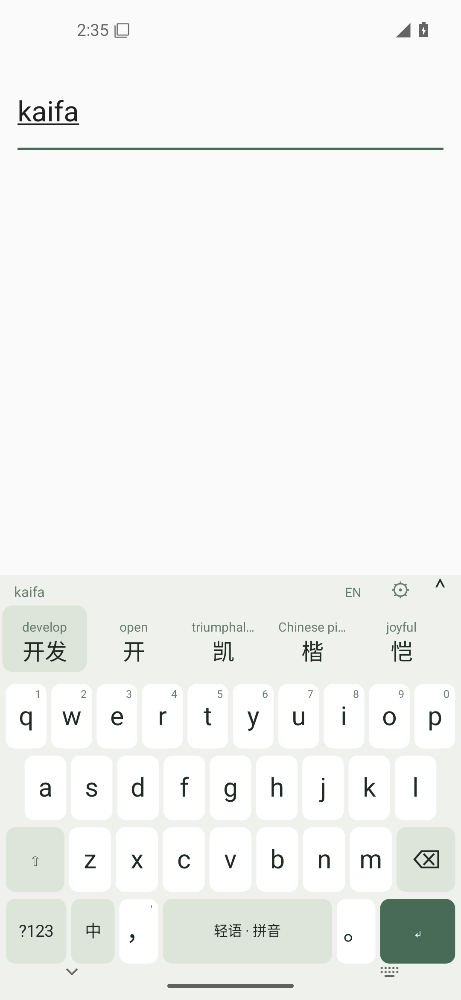
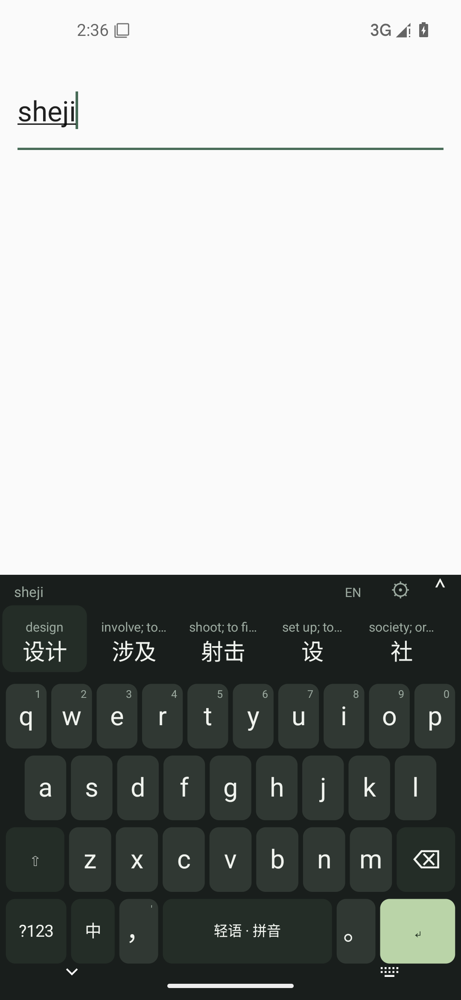

<p align="center">
  
</p>

<h1 align="center">轻语输入法 · Qingyu</h1>
<p align="center">边打中文，边自然学习英语。<br />Type Chinese. Meet English along the way.</p>

<p align="center">
  <a href="README_EN.md">English</a> · 中文
</p>

<p align="center">
  <a href="https://github.com/sharbvane/qingyu-input-method/releases/latest"></a>
  <a href="LICENSE"></a>
  
</p>

**轻语首先是一款正常的中文输入法。** 像平常一样输入拼音、选择中文；候选上方会安静地出现一条本地英文释义。点「开发」，上屏的仍然只有「开发」。

## 看看它

| 浅色模式 | 深色模式 |
| --- | --- |
|  |  |

以上为 Android 15 模拟器中的实际运行截图。

## 功能

- **中文全拼**：基于 AOSP PinyinIME 原生解码器，支持整句与分段候选、翻页和展开。
- **英文自然注释**：本地 CC-CEDICT 词典异步提供候选释义；点击候选仍只输入中文，可随时关闭注释。
- **日常输入**：中文标点、英文、数字和混合输入；连续退格、长按数字、空格滑动光标、候选滑动浏览。
- **简洁外观**：浅色/深色主题、键盘高度设置、轻触反馈与按键预览。
- **离线优先**：没有联网权限或云端翻译；输入和词频留在本机。密码字段直接输入并关闭候选与学习。

词典未命中时英文注释留空。译文表示常见词义，不是语境翻译；AOSP 词库较旧，新词和复杂整句排序仍需持续改进。

## 安装与使用

1. 从 [GitHub Releases](https://github.com/sharbvane/qingyu-input-method/releases/latest) 下载 `Qingyu-0.1.0.apk`，适用于 Android 8.0 及以上。
2. 安装并打开「轻语输入法」，依次选择「启用轻语输入法」和「切换到轻语」。这是 Android 的系统设置步骤。
3. 在任意输入框试试 `kaifa`、`xiangmu` 或 `sheji`。点中文候选，上屏的只有中文。

版本：**v0.1.0** · 系统输入自动化在 Android 15 / x86_64 模拟器上通过 17 项检查。此版本签名用于开源体验；正式稳定版发布前会建立专用发行签名。

## Android 支持情况

| 项目 | 当前情况 |
| --- | --- |
| 系统 | Android 8.0+（API 26+）；目标 SDK 35 |
| 处理器 | arm64-v8a、armeabi-v7a、x86_64 |
| 输入法 | 可在 Android 系统设置中启用并设为默认键盘 |
| 验证 | Android 15 x86_64 模拟器；真机和 OEM 应用兼容性尚待验证 |

## 技术架构

- Android `InputMethodService` 与自有 Canvas 键盘 UI，中文候选和翻译注释分层呈现。
- AOSP PinyinIME C++ 解码器通过 JNI 接入，全部中文事件在单一串行引擎线程处理。
- 与 Android 无关的 `core/` 定义候选快照、引擎及译词 provider 契约，为后续平台扩展留边界。
- 独立低优先级翻译线程查询本地 SQLite 索引，使用内存缓存；译词失败不阻塞中文输入。
- 候选栏位置由中文词决定，英文释义异步补充且不会改变候选宽度。

架构、引擎选择和上游项目对比见[开源研究记录](docs/research.md)。

## 离线与隐私

应用不申请网络权限，不接入广告、分析、云翻译或遥测。拼音和候选由本机处理；可选用户词频只存本机。密码输入不进入中文候选、译词或词频学习。

## 从源码构建

需要 Windows、JDK 17 和 PowerShell 7。工具链脚本会下载项目锁定的 Android SDK、NDK、CMake 与 Gradle 至本地 `.tools/` 目录：

```powershell
pwsh -File scripts/setup-toolchain.ps1
pwsh -File scripts/build.ps1 -Variant Release -Test
```

构建产物位于 `releases/`；项目内工具和签名密钥会被 `.gitignore` 排除。测试方法与实际验证范围见[验证记录](docs/validation.md)。

## 路线图

- [x] 可安装的 Android 中文全拼输入法 MVP
- [x] 候选上方的离线英文释义及开关
- [ ] 基于真机反馈打磨触摸手感、切换速度和功耗
- [ ] 评估更现代的简体中文词库与排序，并保留来源许可
- [ ] 扩充释义抽样校对和本地词典覆盖
- [ ] 设计独立 iOS Keyboard Extension
- [ ] 评估日语、韩语、西班牙语译词 provider

## 参与贡献

欢迎提交问题报告、词典质量反馈和 Pull Request。开始前请阅读[贡献指南](CONTRIBUTING.md)，说明复现步骤和 Android 版本；改动请附上相应构建或测试结果。提交的轻语自有代码按 GPL-3.0-only 提供。第三方代码、词典和媒体仍按其各自来源与许可证分发。

## 许可证与来源

**轻语自有代码采用 GNU GPL-3.0-only**，见根目录 [LICENSE](LICENSE)。项目包含按其原许可证与声明分发的第三方内容：AOSP PinyinIME 源码按 Apache-2.0；改编的 CC-CEDICT 数据按 CC BY-SA 4.0。请保留对应来源和声明：

- [第三方许可与 NOTICE 说明](LICENSE-THIRD-PARTY.md)
- [AOSP PinyinIME 来源及修改记录](third_party/pinyinime/SOURCE.md)
- [CC-CEDICT 词典来源及处理方式](third_party/cedict/README.md)

GNU GPL、Apache 与 CC BY-SA 的并存和兼容范围按各自原许可处理，不以本项目根目录的 GPL 声明抹去上游权利。商标、名称及 logo 不随代码许可转让。

<p align="center"><sub>轻一点输入，久一点相遇。 · Type lightly. Learn naturally.</sub></p>
