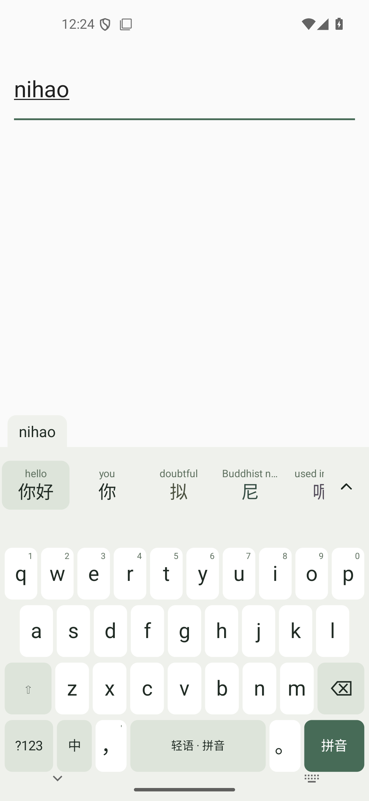
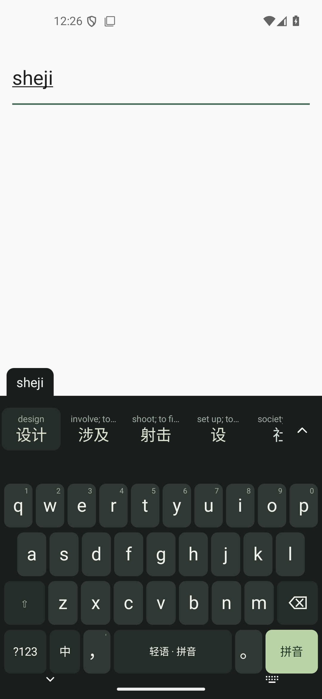

<p align="center">
  
</p>

<h1 align="center">轻语输入法 · Qingyu</h1>
<p align="center">边打中文，边自然学习英语。<br />Type Chinese. Meet English along the way.</p>

<p align="center">
  <a href="README_EN.md">English</a> · 中文
</p>

<p align="center">
  <a href="https://github.com/sharbvane/qingyu-srf/releases/download/v0.6.5/Qingyu-0.6.5.apk"></a>
  <a href="LICENSE"></a>
  
</p>

**轻语首先是一款正常的中文输入法。** 像平常一样输入拼音、选择中文；候选上方会安静地出现所选语言的释义，默认英语、本地词典优先。点「开发」，上屏的仍然只有「开发」。

## 看看它

| 浅色模式 | 深色模式 |
| --- | --- |
|  |  |

**v0.6.5 九键优化版现已发布**：[GitHub Release 与 APK 下载](https://github.com/sharbvane/qingyu-srf/releases/tag/v0.6.5)，附 [SHA-256 校验文件](https://github.com/sharbvane/qingyu-srf/releases/download/v0.6.5/Qingyu-0.6.5.apk.sha256)、[安装说明](releases/README-v0.6.5.md)和[验证记录](docs/validation-v0.6.5.md)。预览图保留为主题示意，不代表 v0.6.5 的最新细节。

## 功能

- **中文全拼与九键**：AOSP 原生解码器结合固定版本的 Rime-ice 现代词库及本地索引，支持多种拼音切分、整句组词与分段选词。v0.6 加入真实中文语料的上下文统计，改善长句组词与预测；全拼「分词」键可手动加入拼音分隔。长期选词习惯在本机逐步提高词语、简拼和短语排序，保留已有学习记录；轻微误触纠错仅作为可选候选，原始拼音始终保留。全拼原始拼音在键盘左上方紧贴边缘凸出显示；全拼回车提交原始拼音。九键显示按键组合对应的候选拼音，确认提交中文候选。
- **九键布局与滑选**：三列字母键配合左侧标点或拼音选择、右侧删除和清空、双行高确认键；独立分词、符号与数字入口。长按字母组展开大小写字母和数字浮层，滑动高亮，松手输入选中的单个字符，取消不输入。拼音随候选与分段选词同步更新，数字仅在明确选择或数字模式中上屏。
- **英文候选与预测**：12 万余词形的补全、拼写建议、上下文下一词预测；英文候选默认显示中文释义，空格保留实际输入的拼写。
- **紧凑键盘顶部**：空闲时显示较矮的空候选栏与图标导航；正在输入时，候选区覆盖导航区域，结束后恢复导航。顶部整体保留固定空间，按键位置不跳动。展开列表替换按键区域，可上下连续滑动浏览；长句及对应翻译完整换行。连续选择预测最多 3 轮，右侧「X」立即清空当前预测；没有可靠上下文时可不显示预测。
- **自然接触外语**：本地释义优先，已下载的端侧模型异步补充可见候选的单字、词语、短语和长句翻译，不等待翻译才显示中文候选。轻点输入原词，长按查看分层详情，上滑直接输入所选语言的简洁译文；完整多义解释保留在详情中。语言切换同步更新候选、详情与上滑译文。普通候选栏与展开列表不显示 Google 品牌栏或标识；长按详情保留模型译文来源，具体来源要求见 [SDK 说明](third_party/mlkit/SOURCE.md)。
- **短语与句子翻译**：常用短语先查本地；其他句子使用下载后的端侧模型，译文异步返回，失败不改变原输入。
- **简洁导航与编辑**：更多、文本编辑、Emoji、键盘模式与收起；再次点同一导航图标关闭面板。选择、全选、复制、剪切、粘贴及最近 100 条剪贴板历史。
- **更新与项目入口**：「更多 → 检查更新」在应用内查看 GitHub 正式版本、更新说明和 APK 大小，下载后校验版本与签名，再进入系统安装流程。「项目主页」打开官方 GitHub 项目页。
- **分词与快捷输入**：中文全拼使用「分词」键调整拼音切分；英文保留 Shift 临时大写与双击锁定。普通字母长按后左滑选大写、右滑选小写；带数字的字母长按后左侧大写、中间小写、右侧数字，松手输入选中字符。
- **克制的词性配色**：确有 jieba 词性标签的中文词，以低饱和颜色区分名词、动词、形容词、副词与虚词。未知词和英文保持中性颜色；标签为词典默认词性，不作上下文消歧。
- **日常输入**：中文标点、英文、数字和混合输入；连续退格、空格滑动光标、候选滑动浏览。
- **简洁外观**：墨绿色浅色/深色主题、78%–124% 连续高度、两种键盘风格、轻触反馈与按键预览。
- **本机输入**：拼音、英文、词频及剪贴板在本机处理。密码字段关闭候选、释义、学习及剪贴板记录；标为敏感的系统剪贴板不留历史。

词典释义表示常见词义，模型翻译也可能不准确。没有可用释义或翻译时候选注释留空，中文输入始终继续。整句组词采用有明确预算的词频、语料上下文和本机习惯排序；复杂语境、九键歧义和英文预测仍需真机反馈打磨。详情例句只展示可追溯的真实语料摘录，找不到合适例句时留空。

## 安装与使用

1. 下载并安装 [Qingyu v0.6.5 APK](https://github.com/sharbvane/qingyu-srf/releases/download/v0.6.5/Qingyu-0.6.5.apk)，从 [GitHub Release](https://github.com/sharbvane/qingyu-srf/releases/tag/v0.6.5) 获取 SHA-256 校验文件。历史版本见[全部 Releases](https://github.com/sharbvane/qingyu-srf/releases)。适用于 Android 8.0 及以上。
2. 安装并打开「轻语输入法」，依次选择「启用轻语输入法」和「切换到轻语」。这是 Android 的系统设置步骤。
3. 在任意输入框试试 `anzhuo`、`dangang` 或 `nohao`。点中文候选，上屏的只有中文。

当前公开版本：**v0.6.5**。APK、SHA-256 和[验证记录](docs/validation-v0.6.5.md)见 [GitHub Release](https://github.com/sharbvane/qingyu-srf/releases/tag/v0.6.5)。可从 v0.6.0 覆盖安装并保留学习记录；签名与备份方式见[说明](docs/release-signing.md)。真机长期使用尚未验证。

在「更多 → 释义显示语言」选择英语、日语、法语、德语、俄语或西班牙语。首次明确选择所需的非英语语言会发起按需模型下载；普通打字不触发下载。默认使用 Wi-Fi，也可在「翻译模型管理」明确允许移动数据。管理页显示真实已下载字节、可读取的总量、等待状态及失败原因，可重试、查看实际已安装大小或删除模型；总量未知时显示不定进度。日、法、德、俄、西五种额外模型已在 Android 15 / API 35 模拟器上实际重新下载并完成端侧翻译检查，网络仍需能访问官方模型服务。未下载的额外语言不预占模型存储，中文和英文键盘始终保留。

「检查更新」也可从应用设置打开。安装更新需要 Android 的安装来源授权及系统确认；不静默安装。下载恢复、包校验和失败处理见[应用内更新说明](docs/in-app-updates.md)。

## Android 支持情况

| 项目 | 当前情况 |
| --- | --- |
| 系统 | Android 8.0+（API 26+）；目标 SDK 35 |
| 处理器 | arm64-v8a、armeabi-v7a、x86_64 |
| 输入法 | 可在 Android 系统设置中启用并设为默认键盘 |
| 验证 | Android 15 x86_64 模拟器；真机和 OEM 应用兼容性尚待验证 |

## 技术架构

- Android `InputMethodService` 与自有 Canvas 键盘 UI，中文候选和翻译注释分层呈现。
- AOSP PinyinIME C++ 解码器通过 JNI 接入，现代拼音/简拼索引与有界整句组词补充候选；固定 TRAIN 语料生成的字符、词性及下一词统计补充上下文排序。全部中文事件在单一串行引擎线程处理。
- 与 Android 无关的 `core/` 定义候选快照、引擎及译词 provider 契约，为后续平台扩展留边界。
- 独立低优先级翻译线程查询本地 SQLite 索引，使用内存缓存；译词失败不阻塞中文输入。
- 普通候选栏位置由中文词决定，外语释义异步补充且不会改变候选宽度；展开列表完整换行。
- 键盘顶部整体固定为竖屏 100 dp、横屏 92 dp，由空闲时的候选/导航与输入中的候选区复用；原始拼音紧贴顶部边缘。展开网格在现有键盘 body 内纵向滑动；本地词性查询与译词同在辅助线程，查不到标签不影响输入。

架构、引擎选择和上游项目对比见[开源研究记录](docs/research.md)。

## 离线与隐私

拼音、候选、译文生成及剪贴板处理在本机进行，不调用云端文本翻译接口。APK 默认仅内置中文与英文词典、本地释义和中文上下文统计；较广的句子翻译需下载端侧模型，日语、法语、德语、俄语与西班牙语释义也需要对应模型。首次明确选择非英语释义语言会启动按需下载，默认需 Wi-Fi，也可明确允许移动数据；从「翻译模型管理」可主动下载或重试。正常输入按键不会触发模型下载。

应用有网络权限。Google ML Kit 会联网下载模型，也可能为配置、兼容性及诊断发送设备/安装标识、语言配置、输入输出长度和性能元数据；SDK 不发送输入或译文原文。详情见[端侧 SDK 来源与隐私说明](third_party/mlkit/SOURCE.md)。用户主动检查更新时读取 GitHub Releases 元数据，下载请求不附带输入或剪贴板内容。剪贴板历史可在面板清空、在设置关闭；不上传。应用未接入广告。

当前官方模型 SDK 的 ARM64 原生库存在 16KB 页对齐限制。此类设备暂时禁用模型翻译以避免影响输入，本地中英词典及中英常用短语仍可使用，设置会显示明确状态。

## 从源码构建

需要 Windows、JDK 17 和 PowerShell 7。工具链脚本会下载项目锁定的 Android SDK、NDK、CMake 与 Gradle 至本地 `.tools/` 目录：

```powershell
pwsh -File scripts/setup-toolchain.ps1
pwsh -File scripts/build.ps1 -Variant Release -Test
```

构建产物位于 `releases/`；项目内工具和签名密钥会被 `.gitignore` 排除。新环境应先恢复已有签名材料，禁止生成替代密钥；见[签名说明](docs/release-signing.md)。v0.6.5 测试方法与实际验证范围见[验证记录](docs/validation-v0.6.5.md)，安装与已知限制见[发布说明](releases/README-v0.6.5.md)。

## 路线图

- [x] 可安装的 Android 中文全拼输入法 MVP
- [x] 候选上方的离线英文释义及开关
- [ ] 基于真机反馈打磨触摸手感、切换速度和功耗
- [x] 固定来源的现代简体中文词库、歧义切分、整句组词与渐进学习
- [ ] 扩充释义抽样校对和本地词典覆盖
- [ ] 设计独立 iOS Keyboard Extension
- [x] 英语、日语、法语、德语、俄语、西班牙语释义与端侧句子翻译
- [x] 英文候选、九键、编辑面板和上下文下一词预测
- [x] 应用内检查更新、下载及系统覆盖安装入口
- [ ] 评估韩语译词 provider

## 参与贡献

欢迎提交问题报告、词典质量反馈和 Pull Request。开始前请阅读[贡献指南](CONTRIBUTING.md)，说明复现步骤和 Android 版本；改动请附上相应构建或测试结果。提交的轻语自有代码按 GPL-3.0-only 提供。第三方代码、词典和媒体仍按其各自来源与许可证分发。

## 许可证与来源

**轻语自有代码采用 GNU GPL-3.0-only**，见根目录 [LICENSE](LICENSE)。项目包含按其原许可证与声明分发的第三方内容：AOSP PinyinIME 源码按 Apache-2.0；改编的 CC-CEDICT 数据按 CC BY-SA 4.0。请保留对应来源和声明：

- [第三方许可与 NOTICE 说明](LICENSE-THIRD-PARTY.md)
- [AOSP PinyinIME 来源及修改记录](third_party/pinyinime/SOURCE.md)
- [CC-CEDICT 词典来源及处理方式](third_party/cedict/README.md)
- [UD Chinese GSDSimp 上下文统计与真实例句](third_party/input-data/chinese-context/SOURCE.md)：CC BY-SA 4.0，固定版本仅使用 TRAIN；DEV/TEST 不参与统计或例句，保留上游关于底层文本权利的声明。

GNU GPL、Apache 与 CC BY-SA 的并存和兼容范围按各自原许可处理，不以本项目根目录的 GPL 声明抹去上游权利。商标、名称及 logo 不随代码许可转让。

<p align="center"><sub>轻一点输入，久一点相遇。 · Type lightly. Learn naturally.</sub></p>
