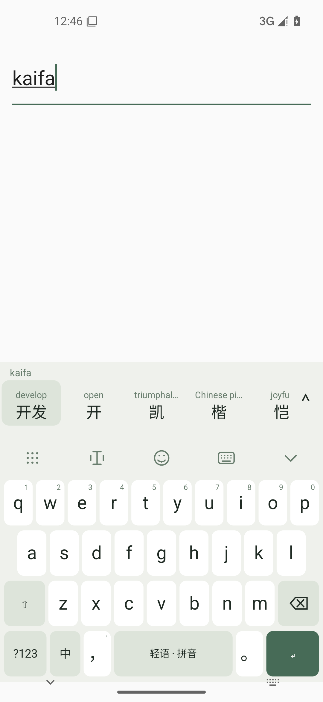
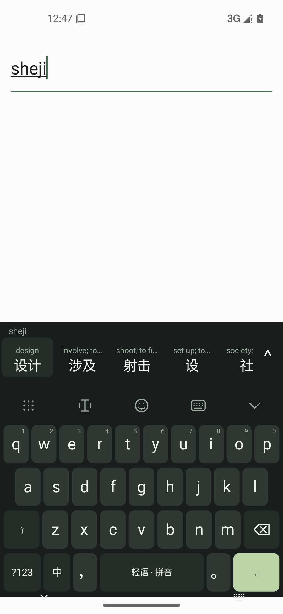

<p align="center">
  
</p>

<h1 align="center">Qingyu Input Method · 轻语</h1>
<p align="center">Type Chinese. Meet English along the way.</p>

<p align="center">
  <a href="README.md">中文</a> · English
</p>

<p align="center">
  <a href="https://github.com/sharbvane/qingyu-srf/releases/latest"></a>
  <a href="LICENSE"></a>
  
</p>

**Qingyu is first a Chinese keyboard.** Type pinyin and choose Chinese as usual. A quiet English gloss appears above a candidate; tapping “开发” still enters only “开发”.

## Preview

| Light theme | Dark theme |
| --- | --- |
|  |  |

Captured from a running Android 15 emulator.

## Features

- **Full pinyin and nine-key:** AOSP native full-pinyin decoder plus a local nine-key reading index with frequency ranking, sentence and segment candidates.
- **English candidates:** Over 121,000 word forms, completions, explicit spelling suggestions and contextual next-word prediction, with Chinese glosses.
- **Quiet language learning:** English, Japanese or French Chinese-candidate glosses. Tap enters the original word, hold opens details, swipe up enters its translation.
- **Phrases and sentences:** Local phrases first; downloaded on-device models translate other sentences asynchronously. Failure preserves normal input.
- **Icon navigation:** More, text editing, Emoji, keyboard modes and hide. Selection, select all, copy, cut, paste and 100 recent clipboard items.
- **Everyday typing:** Chinese punctuation, English, numbers and mixed input; repeat backspace, long-press numbers, spacebar cursor gestures and candidate browsing.
- **Simple keyboard:** Sage light and dark themes, continuous 78%–124% height, two styles, haptics and previews.
- **Local input:** Input and learned frequencies stay on device. Password fields disable candidates, glosses, learning and clipboard history; sensitive system clips are excluded.

Missing glosses stay blank when no model is ready. Dictionary senses and model translations can be inaccurate. The older AOSP lexicon, nine-key ambiguities and modern English prediction still need real-device feedback.

## Install and try it

1. Install the local `releases/Qingyu-0.2.0.apk`. Android 8.0 or newer is required. Published historical versions are available from [GitHub Releases](https://github.com/sharbvane/qingyu-srf/releases).
2. Install and open Qingyu. Use **Enable Qingyu Input Method**, then **Switch to Qingyu**. Android requires these system settings steps.
3. In any text field, type `kaifa`, `xiangmu` or `sheji`. Tap a Chinese candidate to enter Chinese only.

Version **v0.2.0** uses the same testing signature as the preceding release. See the [current validation record](docs/validation-v0.2.0.md). Long-term physical-device use remains unverified.

## Android support

| Item | Current support |
| --- | --- |
| Android | 8.0+ (API 26+); target SDK 35 |
| ABIs | arm64-v8a, armeabi-v7a and x86_64 |
| IME | Enable and select it in Android system settings |
| Validation | Android 15 x86_64 emulator; physical devices and OEM app compatibility still need testing |

## Architecture

- Android `InputMethodService` and an original Canvas keyboard UI.
- AOSP PinyinIME C++ decoder connected through JNI; Chinese input events run on one serial engine thread.
- Android-independent interfaces for candidate snapshots, input engines and translation providers live in `core/` to keep future platform work decoupled.
- A separate low-priority translation worker queries a local SQLite index with an in-memory cache. Lookup failures never block Chinese input.
- Candidate geometry depends on Chinese text; late English glosses do not change candidate width.

See the [upstream and architecture research](docs/research.md).

## Offline and privacy

Input, candidates, translation inference and clipboard processing run on device. No remote text translation endpoint is called. Broader sentence translation requires a user-initiated Wi-Fi model download under More → annotation language. Typing never initiates a download.

The app has network permission. Google ML Kit can contact Google for models, configuration, compatibility and diagnostics, sending device/installation identifiers, language configuration, input/output size and performance metadata; it does not send input or output text. See [SDK provenance and privacy](third_party/mlkit/SOURCE.md). Clipboard history can be cleared or disabled and is not uploaded. No advertising is integrated.

On ARM64 devices using 16 KiB memory pages, model translation is currently disabled because of the official SDK binary's RELRO alignment. Normal input, local dictionary definitions and original three-language phrases remain available; settings show the limitation.

## Build from source

Windows, JDK 17 and PowerShell 7 are required. The setup script downloads the pinned Android SDK, NDK, CMake and Gradle into the ignored local `.tools/` directory:

```powershell
pwsh -File scripts/setup-toolchain.ps1
pwsh -File scripts/build.ps1 -Variant Release -Test
```

Build output goes to `releases/`. Local tools and signing files are excluded by `.gitignore`. See the [validation log](docs/validation-v0.2.0.md) for test scope and results.

## Roadmap

- [x] Installable Android full-pinyin MVP
- [x] Offline English candidate glosses and a display toggle
- [ ] Tune touch feel, app switching and power use on physical devices
- [ ] Evaluate a more modern Simplified Chinese lexicon and ranking with clear source licenses
- [ ] Review gloss quality and expand local dictionary coverage
- [ ] Design a separate iOS Keyboard Extension
- [x] English, Japanese and French annotations and on-device sentence translation
- [x] English candidates, nine-key, text editing and next-word prediction
- [ ] Evaluate Korean and Spanish translation providers

## Contributing

Bug reports, dictionary-quality feedback and pull requests are welcome. Please read [CONTRIBUTING.md](CONTRIBUTING.md), include reproduction steps and the Android version, and report relevant build or test results. New Qingyu-authored code is offered under GPL-3.0-only. Third-party code, data and media remain under their respective licenses.

## License and attributions

**Qingyu-authored code is licensed under GNU GPL-3.0-only**; see [LICENSE](LICENSE). The repository also contains third-party material distributed with its source license and notices: AOSP PinyinIME under Apache-2.0, and an adapted CC-CEDICT dictionary under CC BY-SA 4.0. Preserve the upstream attribution and notices:

- [Third-party licenses and NOTICE](LICENSE-THIRD-PARTY.md)
- [AOSP PinyinIME provenance and changes](third_party/pinyinime/SOURCE.md)
- [CC-CEDICT data provenance and processing](third_party/cedict/README.md)

Each license's terms and compatibility scope continue to apply. The root GPL notice does not erase upstream rights. Trademarks, product names and logos are not transferred by the code license.

<p align="center"><sub>轻一点输入，久一点相遇。 · Type lightly. Learn naturally.</sub></p>
