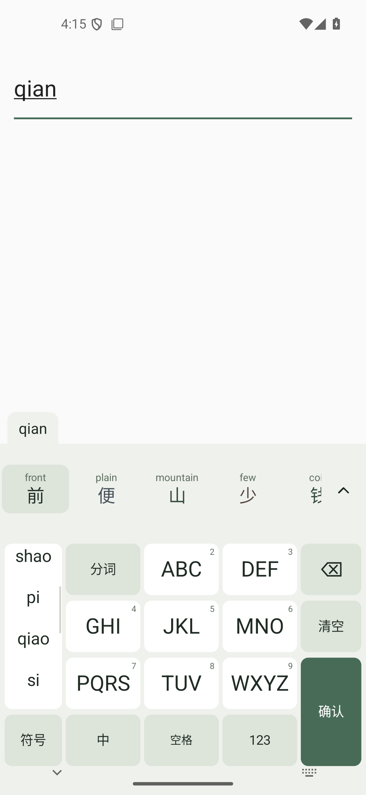
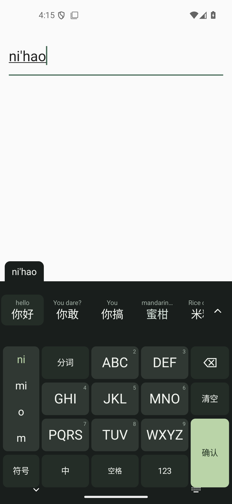

<p align="center">
  
</p>

<h1 align="center">Qingyu Input Method · 轻语</h1>
<p align="center">Type Chinese. Meet English along the way.</p>

<p align="center">
  <a href="README.md">中文</a> · English
</p>

<p align="center">
  <a href="https://github.com/sharbvane/qingyu-srf/releases/download/v0.6.6/Qingyu-0.6.6.apk"></a>
  <a href="LICENSE"></a>
  
</p>

**Qingyu is first a Chinese keyboard.** Type pinyin and choose Chinese as usual. A quiet gloss in the selected language appears above a candidate, with English as the default and local dictionaries first. Tapping “开发” still enters only “开发”.

**Qingyu v0.6.6 nine-key update is now released:** [GitHub Release and APK](https://github.com/sharbvane/qingyu-srf/releases/tag/v0.6.6), [SHA-256 file](https://github.com/sharbvane/qingyu-srf/releases/download/v0.6.6/Qingyu-0.6.6.apk.sha256), [installation notes](releases/README-v0.6.6.md), and [validation](docs/validation-v0.6.6.md). Nine-key preedit shows inferred pinyin. The left rail scrolls through all syllable alternatives and advances after each selection; backtracking reopens previous choices without committing text. Holding a letter group opens a slide-to-select uppercase/lowercase/number picker.

## Preview

| Light theme | Dark theme |
| --- | --- |
|  |  |

Screenshots show the actual v0.6.6 nine-key keyboard.

## Features

- **Full pinyin and nine-key:** The AOSP decoder uses a pinned modern Rime-ice lexicon, with indexed alternate segmentations and bounded sentence composition. v0.6 adds context statistics from real Chinese text to improve sentence composition and prediction. Full pinyin has a manual segmentation key to insert a pinyin separator. Repeated word, initials and phrase choices gradually improve local ranking while preserving existing learning records. One-edit typo suggestions are optional candidates and preserve the original letters. Full-pinyin Enter commits raw letters; nine-key confirmation commits a Chinese candidate.
- **English candidates:** Over 121,000 word forms, completions, explicit spelling suggestions and contextual next-word prediction, with Chinese glosses.
- **Compact keyboard top:** Idle shows a short empty candidate strip and icon navigation. While composing, candidates replace the navigation area; navigation returns when composition ends. Fixed overall top space keeps the keys steady. The expanded list replaces the keys, scrolls continuously up and down, and wraps complete sentences and translations. A prediction chain stops after at most three selections; the rightmost X clears current predictions. Unreliable contexts can produce no prediction.
- **Quiet language learning:** Local definitions come first; installed on-device models asynchronously fill missing visible character, word, phrase and sentence translations. Chinese candidates do not wait for translation. Tap enters the original word, hold opens layered details, and swipe up directly enters a concise translation in the selected language. Full dictionary senses remain in details. Switching the language updates candidates, details and swipe translations together. The compact candidate row and expanded list show no Google brand strip or badge; held-candidate details retain model attribution. See the [SDK attribution notes](third_party/mlkit/SOURCE.md) for the applicable source requirements.
- **Phrases and sentences:** Local phrases first; downloaded on-device models translate other sentences asynchronously. Failure preserves normal input.
- **Icon navigation:** More, text editing, Emoji, keyboard modes and hide. Tap the same icon again to close its panel. Selection, select all, copy, cut, paste and 100 recent clipboard items.
- **Updates and project links:** More → Check for updates shows the official GitHub release version, notes and APK size inside the app. Downloads undergo package and signing checks before Android handles installation. Project homepage opens the official repository.
- **Segmentation and letter shortcuts:** Chinese full pinyin uses a manual segmentation key. English retains Shift for temporary uppercase and a quick double-tap to lock uppercase. Hold a letter and slide left for uppercase or right for lowercase; digit-bearing letters offer uppercase on the left, lowercase in the middle and the digit on the right. Release to enter the highlighted character.
- **Quiet part-of-speech colors:** Exact jieba Chinese dictionary tags select muted noun, verb, adjective, adverb and function-word tones. Unknown and English words remain neutral. These are lexical defaults, not contextual disambiguation.
- **Everyday typing:** Chinese punctuation, English, numbers and mixed input; repeat backspace, spacebar cursor gestures and candidate browsing.
- **Simple keyboard:** Sage light and dark themes, continuous 78%–124% height, two styles, haptics and previews.
- **Local input:** Input and learned frequencies stay on device. Password fields disable candidates, glosses, learning and clipboard history; sensitive system clips are excluded.

Missing definitions or unavailable translations stay blank. Dictionary senses and model translations can be inaccurate. The bounded sentence beam combines source frequencies, corpus context and local habits; complex semantics, nine-key ambiguities and English prediction still need real-device feedback. Detail examples are traceable excerpts from real source text, with no example shown when none is suitable.

## Install and try it

1. Download and install the [Qingyu v0.6.6 APK](https://github.com/sharbvane/qingyu-srf/releases/download/v0.6.6/Qingyu-0.6.6.apk), and get its SHA-256 file from the [GitHub Release](https://github.com/sharbvane/qingyu-srf/releases/tag/v0.6.6). Earlier versions are listed under [all GitHub Releases](https://github.com/sharbvane/qingyu-srf/releases). Android 8.0 or newer is required.
2. Install and open Qingyu. Use **Enable Qingyu Input Method**, then **Switch to Qingyu**. Android requires these system settings steps.
3. In any text field, try `anzhuo`, `dangang` or `nohao`. Tap a Chinese candidate to enter Chinese only.

The current public release is **v0.6.6**. Download the APK and SHA-256 file from the [GitHub Release](https://github.com/sharbvane/qingyu-srf/releases/tag/v0.6.6), and read the [validation record](docs/validation-v0.6.6.md). It installs over v0.6.5 and preserves learning data. See [signing and backup](docs/release-signing.md). Long-term physical-device use remains unverified.

Choose English, Japanese, French, German, Russian or Spanish under More → annotation language. Explicitly selecting a required non-English language for the first time starts its optional model download. Normal typing never downloads a model. Wi-Fi is the default; Translation model management can explicitly allow mobile data. The page shows real transferred bytes, a known total or an indeterminate indicator, waiting states, failure reasons and retry, plus installed size and deletion. The five extra Japanese, French, German, Russian and Spanish models have been freshly downloaded and tested for on-device translation on the Android 15 / API 35 emulator. Downloads still require a network that can reach the official model service. Extra languages reserve no model storage before downloading. Chinese and English keyboards remain available.

Check for updates is also available in app settings. Android requires installation-source permission and system confirmation; installation is not silent. See [in-app update behavior](docs/in-app-updates.md) for download restoration, package validation and recovery.

## Android support

| Item | Current support |
| --- | --- |
| Android | 8.0+ (API 26+); target SDK 35 |
| ABIs | arm64-v8a, armeabi-v7a and x86_64 |
| IME | Enable and select it in Android system settings |
| Validation | Android 15 x86_64 emulator; physical devices and OEM app compatibility still need testing |

## Architecture

- Android `InputMethodService` and an original Canvas keyboard UI.
- AOSP PinyinIME through JNI, supplemented by indexed modern full-pinyin/initials candidates and bounded sentence composition. Character, part-of-speech and next-token statistics from a pinned TRAIN corpus provide context ranking. Chinese events run on one serial engine thread.
- Android-independent interfaces for candidate snapshots, input engines and translation providers live in `core/` to keep future platform work decoupled.
- A separate low-priority translation worker queries a local SQLite index with an in-memory cache. Lookup failures never block Chinese input.
- Compact candidate geometry depends on Chinese text; late foreign-language glosses do not change candidate width. Expanded entries wrap complete text.
- The overall keyboard top reserves 100 dp in portrait and 92 dp in landscape, shared between idle candidates/navigation and the composing candidate area. Raw pinyin remains attached to its upper edge. The expanded grid scrolls vertically within the existing keyboard body. Lexical tag lookup shares the auxiliary worker; missing tags do not affect input.

See the [upstream and architecture research](docs/research.md).

## Offline and privacy

Input, candidates, translation inference and clipboard processing run on device. No remote text translation endpoint is called. The APK includes only Chinese and English dictionaries, local meanings and Chinese context statistics. Broader sentence translation needs on-device models; Japanese, French, German, Russian and Spanish glosses additionally need their language models. First explicitly selecting a non-English annotation language starts an optional download, with Wi-Fi as the default and mobile data available through an explicit choice. Models can also be downloaded or retried from Translation model management. Ordinary typing never initiates a model download.

The app has network permission. Google ML Kit can contact Google for models, configuration, compatibility and diagnostics, sending device/installation identifiers, language configuration, input/output size and performance metadata; it does not send input or output text. See [SDK provenance and privacy](third_party/mlkit/SOURCE.md). Explicit update checks read GitHub Releases metadata; download requests include no input or clipboard text. Clipboard history can be cleared or disabled and is not uploaded. No advertising is integrated.

v0.6.6 replaces the blanket 16 KiB ARM64 model block with a background check of the actual packaged official native library. Safe layouts can download and translate; unknown or unsafe binaries retain local input and definitions. Official binaries are unchanged. Runtime checks cover a 16 KiB x86_64 emulator; ARM64 physical devices remain untested. See [SDK evidence and limits](third_party/mlkit/SOURCE.md).

## Build from source

Windows, JDK 17 and PowerShell 7 are required. The setup script downloads the pinned Android SDK, NDK, CMake and Gradle into the ignored local `.tools/` directory:

```powershell
pwsh -File scripts/setup-toolchain.ps1
pwsh -File scripts/build.ps1 -Variant Release -Test
```

Build output goes to `releases/`. Local tools and signing files are excluded by `.gitignore`. Restore the existing signing materials on a new machine; never generate a replacement key. See [signing](docs/release-signing.md), the [v0.6.6 validation record](docs/validation-v0.6.6.md) and [installation notes and limits](releases/README-v0.6.6.md).

## Roadmap

- [x] Installable Android full-pinyin MVP
- [x] Offline English candidate glosses and a display toggle
- [ ] Tune touch feel, app switching and power use on physical devices
- [x] Pinned modern Chinese lexicon, alternate segmentation, sentence composition and gradual learning
- [ ] Review gloss quality and expand local dictionary coverage
- [ ] Design a separate iOS Keyboard Extension
- [x] English, Japanese, French, German, Russian and Spanish annotations and on-device sentence translation
- [x] English candidates, nine-key, text editing and next-word prediction
- [x] In-app update checks, downloads and a system installation entry point
- [ ] Evaluate a Korean translation provider

## Contributing

Bug reports, dictionary-quality feedback and pull requests are welcome. Please read [CONTRIBUTING.md](CONTRIBUTING.md), include reproduction steps and the Android version, and report relevant build or test results. New Qingyu-authored code is offered under GPL-3.0-only. Third-party code, data and media remain under their respective licenses.

## License and attributions

**Qingyu-authored code is licensed under GNU GPL-3.0-only**; see [LICENSE](LICENSE). The repository also contains third-party material distributed with its source license and notices: AOSP PinyinIME under Apache-2.0, and an adapted CC-CEDICT dictionary under CC BY-SA 4.0. Preserve the upstream attribution and notices:

- [Third-party licenses and NOTICE](LICENSE-THIRD-PARTY.md)
- [AOSP PinyinIME provenance and changes](third_party/pinyinime/SOURCE.md)
- [CC-CEDICT data provenance and processing](third_party/cedict/README.md)
- [UD Chinese GSDSimp context statistics and real examples](third_party/input-data/chinese-context/SOURCE.md): CC BY-SA 4.0, pinned TRAIN input only; DEV/TEST never contribute statistics or examples, and the upstream caveat about rights in underlying text is retained.

Each license's terms and compatibility scope continue to apply. The root GPL notice does not erase upstream rights. Trademarks, product names and logos are not transferred by the code license.

<p align="center"><sub>轻一点输入，久一点相遇。 · Type lightly. Learn naturally.</sub></p>
