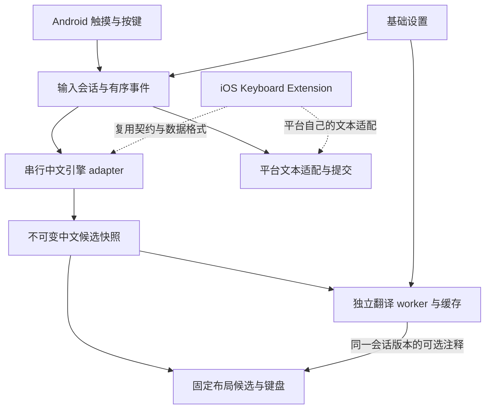

# 开源输入法与架构研究

研究日期：2026-10-04。本文区分上游已核实事实、本项目的工程选择与尚未验证的事项。只研究公开的一手仓库、源码与平台文档；用户提供的截图作为交互参考，不作为源码或性能证据。

## 结论与首版底座

首版采用自有 Android `InputMethodService` 与键盘 UI，接入 **AOSP PinyinIME 的 C++ 全拼解码器**，把中文输入、翻译注释、Android 系统适配分开。它提供真实拼音搜索、候选选择、分段选择与用户词库，不依赖少量手工词条模拟中文输入。AOSP 仓库明确提供 Apache-2.0 的模块标记与 NOTICE。Java 层是封装，解码器并非纯 Java。[AOSP 源码](https://android.googlesource.com/platform/packages/inputmethods/PinyinIME/+/refs/heads/main/)、[NOTICE](https://android.googlesource.com/platform/packages/inputmethods/PinyinIME/+/refs/heads/main/NOTICE)、[Java 解码服务](https://android.googlesource.com/platform/packages/inputmethods/PinyinIME/+/refs/heads/main/src/com/android/inputmethod/pinyin/PinyinDecoderService.java)

这个选择降低首个可安装版本的构建与维护成本，同时保留自有 UI 与品牌。AOSP 词库与引擎较旧，现代人名、新词、网络词、复杂整句排序仍需持续测评。它是首版可用的引擎基础，不能据此承诺已达到现代商业输入法的候选准确率。长期推荐保留可替换的引擎契约，评估 **librime + 明确授权的简体全拼方案/词库**；性能、词库质量、包体与用户学习迁移应在同一组语料上比较。

## 调研对照

| 项目 | 已核实能力与架构 | 许可与边界 | 对本项目的选择 |
| --- | --- | --- | --- |
| Fcitx5 for Android | Kotlin Android 前端，原生 Fcitx5 框架与中文插件；已有展开候选、键盘反馈、符号、主题、外挂插件 | Android 仓库 LGPL-2.1；源码 SPDX 使用 LGPL-2.1-or-later。原生组件、插件、数据仍须分别核对 | 学习引擎线程、生命周期、候选分页；首版不 fork 完整功能体系 |
| Trime | Java/Kotlin 前端，经 JNI 调用 librime；方案部署、候选分页、组合串、主题配置成熟 | 前端 GPL-3.0-or-later；librime 本体许可另算。复制前端/JNI实现须遵守对应许可 | 学习 Rime 适配与状态机；不复制其前端代码 |
| librime | 平台无关 C++ 核心，YAML 方案；C API 输出组合串、候选、comment、提交文本与页状态 | 本体 BSD-3-Clause；Boost、LevelDB、Marisa、OpenCC、yaml-cpp及插件与数据分别有许可 | 长期引擎候选，优先采用独立适配层 |
| AOSP PinyinIME | Java/JNI 外壳与 C++ 拼音核心，拼音搜索、分段固定、候选、用户词库；无大体积模型要求 | Apache-2.0 模块与 NOTICE；保留来源、声明及修改记录 | 首版原生中文引擎，重写 Android 前端和 JNI 入口 |
| Simple Keyboard | AOSP LatinIME 衍生，克制功能、空格滑动光标、滑动删除、键盘高度、震动 | Apache-2.0 | 学习触摸、滑动与小权限范围；不能用作中文引擎 |
| 青简 Qingjian | Rust 平台无关 Core，与 macOS/Windows/Linux 系统外壳分开；候选附学习语言译词 | GPL-3.0-or-later；名称与 logo 不在代码授权中；数据单独授权 | 学习输入优先与可选 annotation 思想，保留自有代码/UI |
| Z次方输入法 | 用户提供了候选上方显示英文与滑动交互参考 | 本轮官网与网页读取均未成功，未确认源码、许可与内部实现 | 仅把用户指定的产品交互作为参考；不推断其引擎或复制品牌 |

来源：[Fcitx5 Android README](https://github.com/fcitx5-android/fcitx5-android)、[版本配置](https://github.com/fcitx5-android/fcitx5-android/blob/master/build-logic/convention/src/main/kotlin/Versions.kt)、[Trime README](https://github.com/osfans/trime)、[librime README](https://github.com/rime/librime)、[Simple Keyboard](https://github.com/rkkr/simple-keyboard)、[青简 README](https://github.com/qingjian-team/qingjian/blob/main/README.md)、[Z次方官网](https://zcubed.cn/)。官网未读取成功的条目明确保留这一限制。

## 各底座可复用的工程经验

### Fcitx5 Android

`Fcitx.kt` 把原生操作放入专属 dispatcher，维护 ready/stopped 等状态与预编辑/候选缓存。`FcitxDaemon.kt` 用连接管理单例，客户端关闭时断开连接，无客户端时停止引擎。候选展开使用按候选索引与 offset 加载的 PagingSource，说明长列表应按需读取，避免每次按键创建完整视图。我们学习这些生命周期与分层原则，不直接导入其实现。[引擎源码](https://github.com/fcitx5-android/fcitx5-android/blob/master/app/src/main/java/org/fcitx/fcitx5/android/core/Fcitx.kt)、[连接管理](https://github.com/fcitx5-android/fcitx5-android/blob/master/app/src/main/java/org/fcitx/fcitx5/android/daemon/FcitxDaemon.kt)、[候选分页](https://github.com/fcitx5-android/fcitx5-android/blob/master/app/src/main/java/org/fcitx/fcitx5/android/input/candidates/expanded/CandidatesPagingSource.kt)

完整构建包含 NDK、CMake、Gettext、extra-cmake-modules 与多个子模块。README 的版本说明可能滞后，应以固定提交的 Versions.kt 为准。官方 `prebuilt` 仓库提供 librime 与依赖的 Android 静态库，但不是通用、直接可用的 Java AAR；接入前需匹配 ABI、NDK、平台版本、头文件与各组件许可。[预编译仓库](https://github.com/fcitx5-android/prebuilt)、[工具链元数据](https://github.com/fcitx5-android/prebuilt/blob/master/toolchain-versions.json)

### Trime 与 librime

Trime `Rime.kt` 经专属 dispatcher 调用 JNI，并维护生命周期与组合串/状态缓存；部署属于维护路径，有单独锁，不能混入按键热路径。Rime 适配必须分清原始编码、预编辑文本、已固定前缀、候选与真正的 commit。[Trime Rime.kt](https://github.com/osfans/trime/blob/develop/app/src/main/java/com/osfans/trime/core/Rime.kt)、[原生依赖构建](https://github.com/osfans/trime/blob/develop/app/src/main/jni/CMakeLists.txt)

librime 的 C API 已包含 candidate `text` 与 `comment`，以及组合串位置、分页信息与提交文本；本项目仍应把译词独立于引擎 comment，避免翻译查词与中文候选生成耦合。换引擎时，UI 只接收平台无关快照；语种选择与翻译失败处理无需改 JNI。[librime C API](https://github.com/rime/librime/blob/master/src/rime_api.h)

### AOSP PinyinIME

JNI 提供 open、search、choose、getChoice、getFixedLen、reset、flushCache 等操作。候选选择可能只固定句子的前半部分，必须保留剩余拼音与后续候选；不能简单地把任意点击当成整串提交。原始服务从 `res/raw/dict_pinyin` 打开系统词典，把用户数据写到应用私有目录。首版保留核心字典搜索与用户学习，使用自有轻量 JNI，不依赖旧版系统私有 UI。[Java 封装](https://android.googlesource.com/platform/packages/inputmethods/PinyinIME/+/refs/heads/main/src/com/android/inputmethod/pinyin/PinyinDecoderService.java)、[原生 JNI](https://android.googlesource.com/platform/packages/inputmethods/PinyinIME/+/refs/heads/main/jni/android/com_android_inputmethod_pinyin_PinyinDecoderService.cpp)、[构建文件](https://android.googlesource.com/platform/packages/inputmethods/PinyinIME/+/refs/heads/main/jni/Android.mk)

原生引擎的共享状态要求串行调用。所有输入事件保持顺序，候选查询在单一引擎线程执行，中文候选完成后立即发布。用户词频落盘在生命周期边界进行，不把磁盘写入放到每次按键中。现代 Android 需要重新编译各 ABI，并核实原生库页对齐、64 位兼容和长输入边界；这些是本项目的验证工作，不是上游年代久远代码自然保证的属性。

### 青简与参考交互

青简开发约定明确要求 Core 与平台隔离，一次只显示一个学习语言的可选 annotation，并要求翻译尚未就绪时能先返回候选。本项目沿用这些产品原则；首版直接点候选只提交中文，不增加“滑动译文上屏”来抢占正常输入手势。青简现有译词、学习统计与云联想能力不等于首版必须集成全部功能。[开发约定](https://github.com/qingjian-team/qingjian/blob/main/docs/contributing.md)、[译词说明](https://qingjian.app/docs/learning/translation)

## 本地翻译数据与授权

首版使用 **CC-CEDICT** 的简体中文词头做本地 SQLite 索引，选择短释义，并对用户指定的基础词做少量编辑校正。CC-CEDICT 下载页与本项目下载快照头均说明 CC BY-SA 4.0。来源、快照 SHA-256、加工方式、词条数与人工覆盖保存在 `third_party/cedict/`；加工后的 `zh-en.db` 按同一数据许可提供。这个许可和本项目自有代码的许可分别记录。[CC-CEDICT 官方下载及许可](https://www.mdbg.net/chinese/dictionary?page=cc-cedict)

中文引擎本身使用 AOSP 仓库附带系统拼音字典，按该仓库 Apache-2.0 模块与 NOTICE 保留声明。未来若切换 Rime，方案、词典与语言模型不能仅因引擎是 BSD 就忽略授权；例如官方 `rime-pinyin-simp` 具有单独 Apache-2.0 许可，是可评估的简体方案，而其他第三方词库必须另查。[AOSP NOTICE](https://android.googlesource.com/platform/packages/inputmethods/PinyinIME/+/refs/heads/main/NOTICE)、[Rime 简体方案](https://github.com/rime/rime-pinyin-simp)

词典释义描述常见词义，并不代表当前聊天语境下唯一正确译法。未命中留空，整句、专名、多义词尤其需要校对。候选很长时省略显示，不把任意短词的译法拼成句子译文。首版不采集在线词典结果，不在打字时请求网络翻译。

## 架构与未来平台

`core/` 不依赖 Android 类型，存放候选/引擎快照/译词接口；`app/` 负责服务、文本适配、触摸绘制和 Android 本地词典；原生核心与词典数据有单独边界。当前 Java Core 是平台无关的契约，并非已完成的 iOS 共用二进制。未来通过 C ABI 接入 C++/librime，或在经过 Android 实测后再提取 Rust/Kotlin Multiplatform 核心；不为尚未开发的 iOS 引入首版不需要的运行时。

Android 使用 `InputMethodService` 与 `InputConnection`，生命周期、编辑器类型、组合文本和实际上屏分别处理。切换应用或焦点时更新会话标识，废弃旧候选/译词；退格需考虑选择区、Unicode 与输入连接失效。Android 官方提醒需要覆盖浏览器、富文本编辑器等不同应用行为。[Android IME 指南](https://developer.android.com/develop/ui/views/touch-and-input/creating-input-method)、[InputConnection API](https://developer.android.com/reference/android/view/inputmethod/InputConnection)

iOS 使用独立 `UIInputViewController` 键盘扩展与 `textDocumentProxy`，保留下一输入法按钮。安全输入框和部分应用会切回系统键盘；因此不能宣称 Android 生命周期、选择区能力与 UI 可以原样迁移。默认离线与小数据包对 iOS 扩展同样有价值，内存上限不假设一个未经验证的固定数字。[Apple 自定义键盘文档](https://developer.apple.com/library/archive/documentation/General/Conceptual/ExtensibilityPG/CustomKeyboard.html)

## 必须继续验证的风险

- AOSP 原生字典的候选质量、新词覆盖、用户词频是否满足用户的真实聊天习惯。
- 连续高速输入/删除/分段选择时事件顺序是否保持，旧候选是否可能被误提交。
- 译词延迟、缺失、失败、开关切换时的候选布局是否稳定；中文输入是否始终可用。
- OEM Android 的生命周期、导航栏、横屏、深色主题、密码/数字/URL 输入框兼容。
- 原生 ABI、现代设备的库加载与升级安装；构建成功与真机长期可用是不同验证级别。

本轮 agent-reach 更新检查因网络连接失败无法确认新版本；不据此改变项目依赖或安装任何更新。
